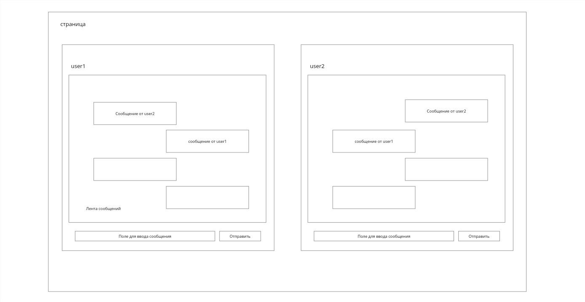

# vue-chat-test-task

## эмулятор двусторонней переписки

Реализовать на одной станице отображение 2-х окон чатов (см. скрин), между которыми можно переписываться.

Сообщения, отправленные каждым пользователем, отображаются в ленте сообщений обоих пользователей.

#### дополнительно

1. никакой серверной части, все взаимодействие происходит на странице

2. для реализации интерфейса использовать vue.js, можно добавить фреймворки
